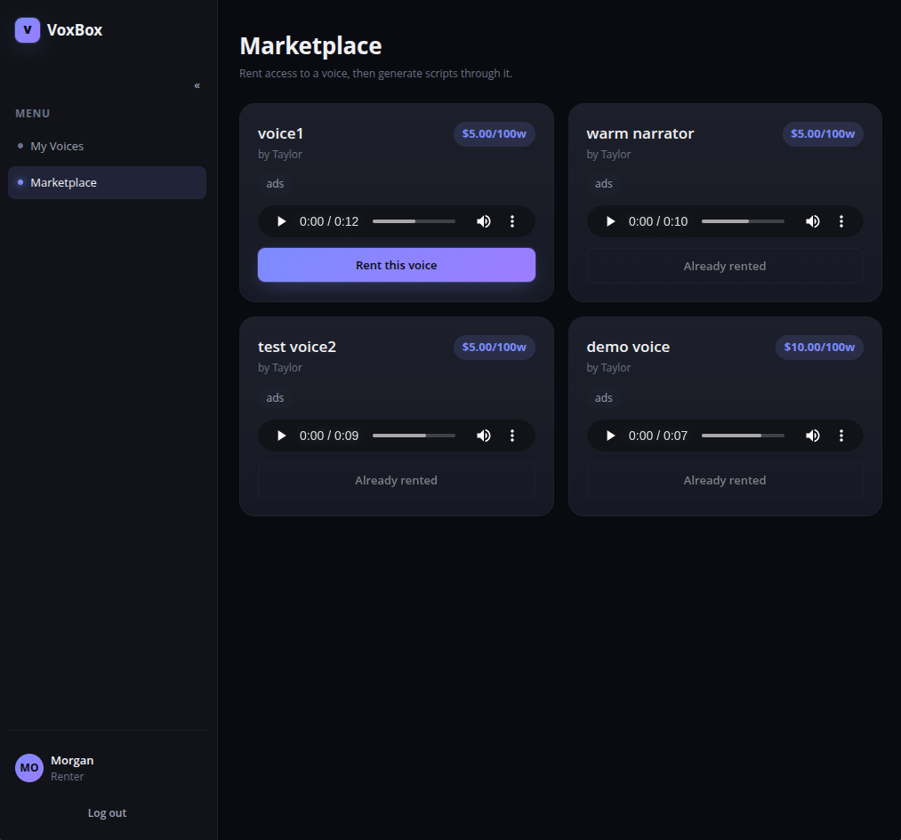
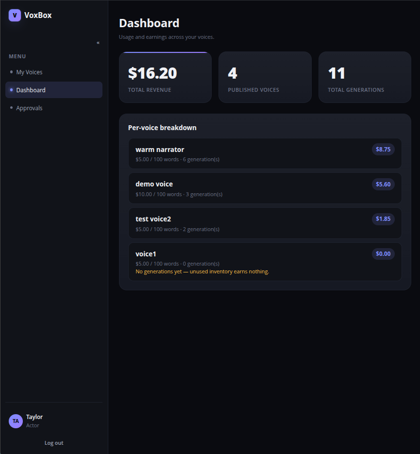
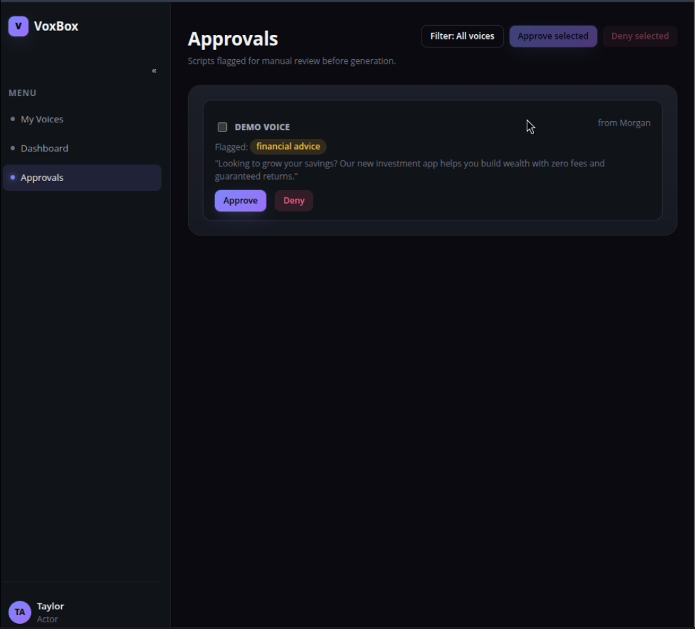

# VoxBox

A consent-first voice cloning marketplace. Voice actors publish cloneable versions of their
voice under explicit, scoped consent; renters pay per generation to use them — with automated
screening and human approval standing between "submit a script" and "audio gets made."

## Screenshots

<!-- Drop PNG/JPG screenshots into docs/screenshots/ and reference them below -->





## Audio samples

<!-- Drop sample .wav/.mp3 files into docs/audio/ — GitHub renders an inline player for direct links to audio files -->

- [Warm narrator — sample](docs/audio/sample_warm_narrator.wav)

## How it works

1. **Record** — an actor reads a generated challenge phrase to clone their voice.
2. **Declare consent** — the actor checks which content categories they allow (ads, political,
   adult, medical claims, financial advice, etc.). Two categories are hard-blocked if undeclared.
3. **Rent** — a renter browses the marketplace, listens to the sample, and unlocks a voice
   (free — the real cost is per generation).
4. **Submit a script** — the renter writes a script. It's billed at a flat rate per 100 words.
5. **Screen & route** — an LLM (Gemma, via Fireworks AI) classifies which categories the script
   touches. A deterministic policy layer — not the model — decides the verdict:
   - **Auto-approved** — every flag is covered by declared consent. Audio generates instantly.
   - **Needs review** — an undeclared, non-blocked flag was raised. Goes to the actor's queue.
   - **Auto-denied** — hate/violence or impersonation was flagged and undeclared. Rejected, no
     human required.
6. **Speak** — approved scripts generate audio via Chatterbox Turbo TTS.

## Tech stack

- **Backend** — FastAPI, flat-file JSON storage
- **Frontend** — vanilla JS/HTML/CSS, no build step
- **Voice cloning** — Chatterbox Turbo TTS
- **Screening** — Gemma, via Fireworks AI
- **Runtime** — Podman + podman-compose

## Running it

```bash
cp .env.example .env   # add your FIREWORKS_API_KEY and SCREENING_MODEL_ID
podman-compose up -d --build
```
